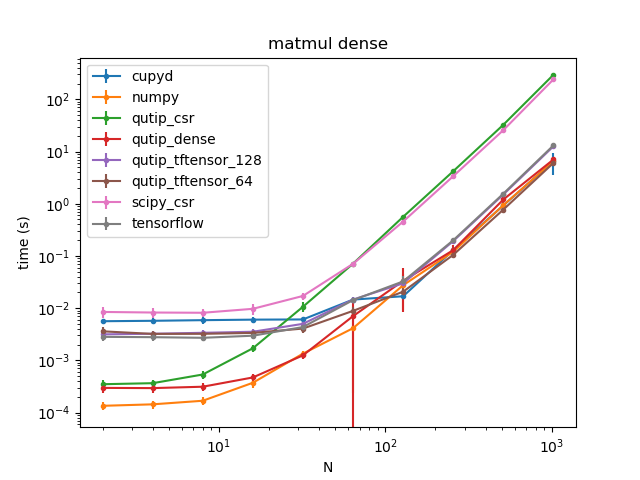

## Week 1 and 2: Benchmarking goals and VM reliabiity

The main goals of these first 2 weeks were to establish what was to be benchmarked and wether performing the benchmarks using a VM (Github actions in this case) is viable. 

We established that there would be two main types of benchmarks: a history benchmark that would track code performance across different updates of qutip and its dependencies. It would be performed regularly using github actions. 
The second benchmark measures code performance based on the size of matrices used to perform the simulations. Qutip contains different datalayers to store operator matrices and vectors and perform calculations with them. The aim of these benchmarks is to establish wich datalayer is most efficient in performing calculations based on matrix density and size. 
While the history benchmark is to be performed regularly on every commit, merge or pull request (still tbd), the scaling benchmark would be performed locally by the user in order to determine which datalayer to use based on his own system ressources.  

Example benchmark performed locally on my laptop: timings of dense matrix multiplication of size N for each datalayer.

---

As of right now the benchmarks are performed using pytest-benchamark. We determined air speed velocity would not be needed since creating the infrastructure to perform the benchmarks ourselves would give us more control and be easier to use with valgrind should it be needed.
So far we are testing the reliabiltiy of github actions in performing benchmarks and the results seem promising. Github actions can allocate one of 5 different processors for every workflow run. If we separate the benchmarks results based on what cpu was allocated during the run, the results seem to be very consistent. More data and analysis is needed though. This will be done in the next two weeks.

Benchmarks for a dense 512x512 matirx multiplication one one of the available cpus provided on github actions

